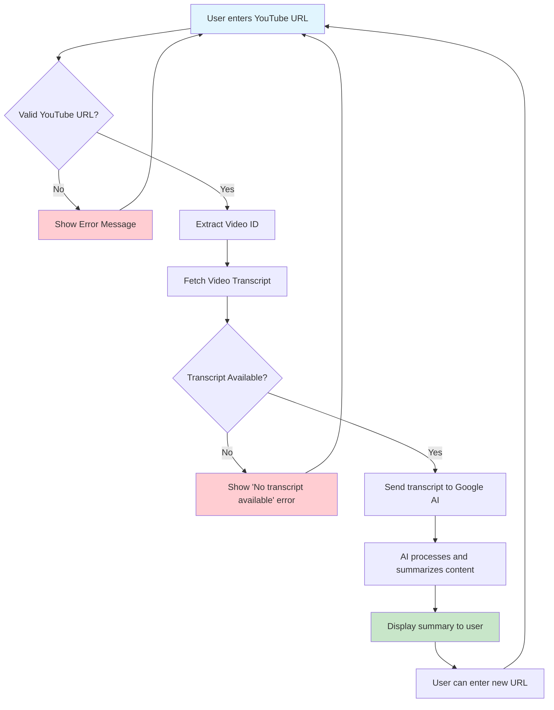

# YouTube Video Summarizer

A Streamlit-based web application that automatically generates summaries of YouTube videos using AI. The app extracts transcripts from YouTube videos and uses Google's Generative AI to create concise, meaningful summaries.

## 🚀 Features

- **YouTube Video Processing**: Extract transcripts from any YouTube video with captions
- **AI-Powered Summarization**: Uses Google's Gemini AI for intelligent content summarization
- **Web Interface**: Clean, user-friendly Streamlit interface
- **Real-time Processing**: Get summaries in seconds
- **Error Handling**: Robust error handling for various edge cases

## 🛠️ Technologies Used

- **Python**: Core programming language
- **Streamlit**: Web application framework
- **Google Generative AI (Gemini)**: AI model for text summarization
- **YouTube Transcript API**: Extract video transcripts
- **python-dotenv**: Environment variable management

## 📋 Prerequisites

- Python 3.7 or higher
- Google AI API key (from Google AI Studio)
- Internet connection

## 🔧 Installation

1. **Clone or download the project**
   ```bash
   cd youtube-video-summarizer-main
   ```

2. **Install required packages**
   ```bash
   pip install -r requirements.txt
   ```

3. **Set up environment variables**
   Create a `.env` file in the project root:
   ```
   GOOGLE_API_KEY=your_google_ai_api_key_here
   ```

4. **Get Google AI API Key**
   - Visit [Google AI Studio](https://makersuite.google.com/app/apikey)
   - Create a new API key
   - Copy the key to your `.env` file

## 🚀 Usage

1. **Start the application**
   ```bash
   streamlit run app.py
   ```

2. **Open your browser**
   - The app will automatically open at `http://localhost:8501`

3. **Use the application**
   - Paste a YouTube video URL
   - Click "Get Detailed Notes"
   - Wait for the AI to process and summarize

## 📊 Application Flow



## 🔄 Detailed Workflow

### 1. **URL Input & Validation**
   - User pastes YouTube video URL
   - System validates URL format
   - Extracts video ID from various YouTube URL formats

### 2. **Transcript Extraction**
   - Uses `youtube_transcript_api` to fetch video captions
   - Handles multiple language support
   - Processes auto-generated and manual captions

### 3. **AI Processing**
   - Sends transcript to Google's Gemini AI model
   - Uses optimized prompt for summarization
   - Processes content while maintaining context

### 4. **Summary Generation**
   - AI generates structured summary
   - Includes key points and main topics
   - Returns formatted, readable content

### 5. **Display Results**
   - Shows summary in clean, formatted layout
   - Provides error messages for failed attempts
   - Allows immediate processing of new videos

## 📁 Project Structure

```
youtube-video-summarizer-main/
│
├── app.py                 # Main Streamlit application
├── requirements.txt       # Python dependencies
├── .env                  # Environment variables (create this)
├── README.md             # Project documentation
└── .gitignore           # Git ignore file (if using version control)
```

## 🔑 Environment Variables

| Variable | Description | Required |
|----------|-------------|----------|
| `GOOGLE_API_KEY` | Google AI API key for Gemini model | Yes |

## 🐛 Troubleshooting

### Common Issues:

1. **"No transcript available"**
   - Video might not have captions enabled
   - Try videos with auto-generated or manual captions

2. **API Key errors**
   - Verify your Google AI API key is correct
   - Check if the API key has proper permissions

3. **Invalid URL format**
   - Ensure you're using a valid YouTube video URL
   - Supported formats: `youtube.com/watch?v=`, `youtu.be/`

4. **Connection errors**
   - Check your internet connection
   - Verify API services are accessible

## 🤝 Contributing

1. Fork the project
2. Create a feature branch
3. Make your changes
4. Test thoroughly
5. Submit a pull request

## 📄 License

This project is open source and available under the [MIT License](LICENSE).

## 🔗 Useful Links

- [Streamlit Documentation](https://docs.streamlit.io/)
- [Google AI Studio](https://makersuite.google.com/)
- [YouTube Transcript API](https://github.com/jdepoix/youtube-transcript-api)

## 📞 Support

If you encounter any issues or have questions, please create an issue in the project repository.

---

**Note**: This application requires active internet connection and valid API credentials to function properly.
